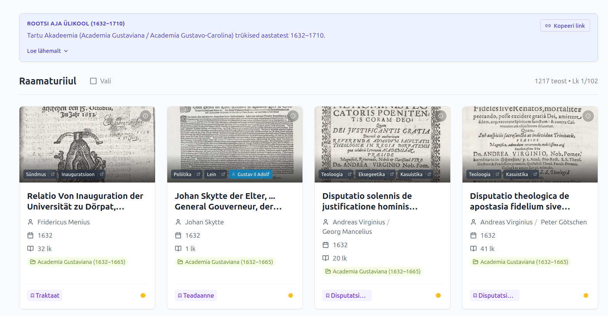

# VUTT – Varauusaegsete Tekstide Töölaud

Veebirakendus TÜ varauusaegsete akadeemiliste tekstide transkriptsioonide vaatamiseks ja toimetamiseks. Kuvab skaneeritud pilti ja OCR-teksti kõrvuti; teksti saab parandada, annoteerida ja otsida.



**Kasutusel:** [vutt.utlib.ut.ee](https://vutt.utlib.ut.ee)

## Funktsioonid

- Teoste sirvimine kollektsioonide, staatuse ja liitfiltritega (autor, aasta, žanr, märksõnad, asukoht)
- Täistekstotsing läbi kõigi transkriptsioonide (Meilisearch)
- OCR-teksti toimetamine originaalpildi kõrval (CodeMirror 6, VUTT markup)
- Struktureeritud metaandmed lingitud andmetena (Wikidata, VIAF, Album Academicum)
- Isikute register (prosopograafia) koos nimevastete ja viidete sünkroonimisega
- Git-põhine versiooniajalugu — originaal-OCR alati taastatav
- Rollipõhine töövoog: contributor muudatused lähevad ülevaatusele, editor salvestab otse
- Admin: üleslaadimise viisard (PDF/JPG → OCR server → import), kasutajahaldus, statistika

## Arhitektuur

```
Frontend (React 19 + Vite + TypeScript + Tailwind CSS)
    ↓ Nginx (hostis, /etc/nginx/sites-available/vutt)
├── Meilisearch (127.0.0.1:7700) – otsing ja metaandmed
├── Image Server   (127.0.0.1:8001) – skaneeritud .jpg pildid
└── File Server / FastAPI (127.0.0.1:8002) – salvestamine, autentimine, Git, upload
    ↓
Failisüsteem: data/{teos-kaust}/{leht}.txt + .jpg + .json + _metadata.json
```

Backend ja Meilisearch jooksevad Dockeris (`docker-compose.yml`). Nginx jookseb hostis ja proxy-b kõik kolm porti.

## Installimine

### Eeltingimused

- Node.js 20+, npm
- Python 3.9+
- Docker + Docker Compose
- Git
- Nginx (host)

### 1. Kloonimmine ja konfiguratsioon

```bash
git clone <repo> VUTT && cd VUTT
cp state/users.json.example state/users.json
```

Kopeeri või loo `state/collections.json` (näide ei ole gitis — vt struktuuri allpool).

### 2. Backend (.env)

Loo `.env` faili projekti juures:

```env
MEILI_MASTER_KEY=vaheta_see_ära
UPLOAD_ENABLED=false          # true kui OCR server konfigureeritud
OCR_SERVER_HOST=              # OCR serveri IP (kui UPLOAD_ENABLED=true)
OCR_SERVER_USER=
OCR_SERVER_PATH=
UMAMI_DB_PASSWORD=vaheta_see_ära
UMAMI_APP_SECRET=vaheta_see_ära
```

Käivita:

```bash
docker compose up -d
```

### 3. Andmete indekseerimine

```bash
python3 -m venv .venv && .venv/bin/pip install -r requirements.txt
.venv/bin/python scripts/1-1_consolidate_data.py   # Loeb data/ → JSON
.venv/bin/python scripts/2-1_upload_to_meili.py    # Laeb Meilisearchi
```

### 4. Frontend

```bash
npm install
npm run build             # Toodangule
# või arenduseks:
npm run dev               # http://localhost:5173
```

### 5. Nginx

Seadista Nginx proxima kolm porti ning serveeri `dist/` staatilisi faile. Kõik `/api/*` päringud → `127.0.0.1:8002`, `/images/*` → `8001`, Meilisearch otsing → `7700` (ainult lugemisõigusega API võtmega).

### 6. Esimene kasutaja

Registreeru `/register` lehel — esimene kasutaja saab admin-rolli automaatselt (või lisa käsitsi `state/users.json`-i).

## Lokaalne arendus (ainult frontend)

```bash
npm install && npm run dev
```

Frontend suhtleb tootmisserveri API-ga, kui `VITE_API_URL` on seadistatud. Lokaalse backendiInstance jaoks käivita `docker compose up -d` ja seadista `.env.local`.

## Testid

```bash
python3 -m venv .venv
.venv/bin/pip install -r requirements-dev.txt
.venv/bin/pytest -q
```

## Andmete struktuur

```
data/
└── 1692-6-disputatio-de-aliquo/
    ├── _metadata.json      # Teose metaandmed (id, pealkiri, aasta, autorid, žanr jne)
    ├── scan_001.jpg
    ├── scan_001.txt        # VUTT markup transkriptsioon
    ├── scan_001.json       # Lehekülje metaandmed ja sequence
    └── ...
```

Metaandmete väljanimed lingitud andmete jaoks kasutavad LinkedEntity formaati:
```json
{ "label": "Tartu", "id": "Q3258", "source": "wikidata", "labels": {"et": "Tartu", "en": "Tartu"} }
```

Toetatud väljanimed: `genre`, `type`, `location`, `publisher`, `tags`, `creators[]`

## Kollektsioonid (`state/collections.json`)

```json
{
  "academia-gustaviana": {
    "name": { "et": "Academia Gustaviana", "en": "Academia Gustaviana" },
    "parent": "universitas-dorpatensis-1",
    "color": "amber"
  }
}
```

Värvid: Tailwind värvnimed (`red`, `amber`, `teal`, `violet` jne). Fail ei ole gitis — kopeeri käsitsi.

## Deploy (tootmisserver)

```bash
# Backend
ssh vutt
cd ~/VUTT && git pull
docker compose build --no-cache backend && docker compose up -d backend

# Frontend
npm run build                        # lokaalses masinas
rsync -avz dist/ vutt:~/VUTT/dist/

# Andmed uuendada (kui data/ muutus)
./scripts/server_seed_data.sh
```

## Rollid

| Roll | Õigused |
|------|---------|
| `contributor` | Muudatused lähevad ülevaatusele |
| `editor` | Otse salvestamine, staatuse muutmine |
| `admin` | Kasutajahaldus, versiooni taastamine, üleslaadimise viisard |

## Tehnoloogiad

React 19 · TypeScript · Vite · Tailwind CSS · CodeMirror 6 · Meilisearch · FastAPI · Python 3.9 · Git · Recharts · react-i18next (et/en)

## Litsents

MIT
