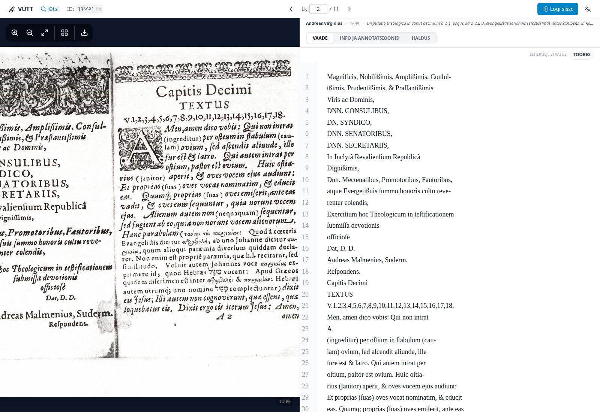
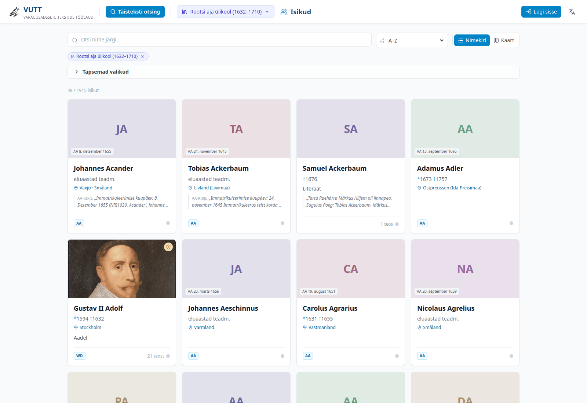

# VUTT — Workbench for Early Modern Texts

**VUTT** (*Varauusaegsete Tekstide Töölaud*) is a web application for reading, correcting and
annotating transcriptions of historical academic texts. Each page shows the digitised original next
to the recognised text, so a transcription can be checked against the source at a glance.

The corpus is built around material connected with early modern Livonia and Estonia — disputations,
orations and occasional prints, regardless of where they were printed — and also includes
19th-century material from the imperial university, including handwritten texts. VUTT is where that
material is transcribed, corrected, described and made searchable.

**Live:** [vutt.utlib.ut.ee](https://vutt.utlib.ut.ee) ·
**About the project:** [vutt.utlib.ut.ee/about_en.html](https://vutt.utlib.ut.ee/about_en.html) ·
**Transcription guide:** [vutt.utlib.ut.ee/transcription_guide_en.html](https://vutt.utlib.ut.ee/transcription_guide_en.html) ·
[Eesti keeles](README.et.md)


## Corpus

The material is grouped into collections, among them:

- **Swedish Era University (1632–1710)** — with Academia Gustaviana (1632–1665) and Academia
  Gustavo-Carolina (1690–1710)
- **Funeral prints** — a thematic collection of funeral publications
- **Pedagogical-Philological Seminar**
- **Herrnhuter materials**

At the time of writing the workspace holds more than **1,200 works and over 20,000 pages** in
Latin, German, Swedish, Greek and Hebrew, along with a register of about **2,100 persons**
connected to the material.

Most page images come from the [UT Library](https://utlib.ut.ee/en) digitised collections and
largely follow the copies collected for Ene-Lille Jaanson's bibliography of the Dorpat University
printing house (*Druckerei der Universität Dorpat 1632–1710*, Tartu University Library, 2000).

## What you can do

### Find and browse

- Filter works by collection, year, genre, author, printer, location, tag and transcription status
- Full-text search over every transcription
- Search persons by name, including variants of the same name

### Transcribe and annotate

- Correct the recognised text beside the page image
- Lightweight markup for italics, marginalia, footnotes, annotations and page breaks
- Comments, page tags and a per-page status (raw / in progress / corrected / finished)
- Download the transcription of a whole work



### Describe and connect

- Structured metadata as linked data (Wikidata, VIAF, Album Academicum)
- Persons register (prosopography) with biographical data, name variants, relations, a map view
  and links to the works a person appears in
- Collections and curated work sets — a selection of works put together for a course, an
  exhibition or a publication



### Keep track of changes

- Git-backed version history; the original recognition result is always restorable
- Recent-changes review page, per-page history and notifications
- Statistics over the corpus (status, genre, timeline)

The interface is available in Estonian and English.

## Recognition models

Page recognition uses two page-based models, one for printed material and one for handwritten
texts. The print model is based on Qwen3.5-8B and was fine-tuned in two rounds — first on roughly
1,500 pages of transcribed printed text from various sources, then on pages finished in VUTT so
that the model learns the VUTT markup. The handwriting model is trained on about 16,600 pages of
public datasets, mainly 14th–19th century German and Swedish chancery and Kurrent hands. The full
model description, dataset list and credits are on the
[about page](https://vutt.utlib.ut.ee/about_en.html).

VUTT prepares the page images and publishes them to the recognition server; the OCR service itself
is a separate system. Uploaded PDFs and JPEGs are split into pages in VUTT before recognition.

## Getting started

### Prerequisites

- Node.js 20+ and npm
- Python 3.9+
- Docker and Docker Compose
- Git

### Set up

```bash
git clone https://github.com/meelisf/VUTT.git
cd VUTT
cp .env.example .env                          # set the values; see the comments in the file
cp state/users.json.example state/users.json
docker compose up -d
```

`.env.example` documents every setting. For local development the keys can be arbitrary values;
`VUTT_ENV=production` additionally refuses to start with development defaults.

Build the search index from the files in `data/`:

```bash
python3 -m venv .venv
.venv/bin/pip install -r requirements.txt
.venv/bin/python scripts/1-1_consolidate_data.py
.venv/bin/python scripts/2-1_upload_to_meili.py
```

Run the frontend:

```bash
npm install
npm run dev            # http://localhost:3000
npm run build          # production build → dist/
```

The development server proxies `/api/*` and `/meili` to the backend configured in
`vite.config.ts` (`DEV_BACKEND`); point it at your own instance.

Access is by request. The `/register` form submits an application that an administrator reviews;
an account can also be added directly to `state/users.json`.

### Tests and checks

```bash
.venv/bin/pip install -r requirements-dev.txt
.venv/bin/pytest -q

npm test               # vitest
npm run typecheck
npm run lint:ci
```

### Data and configuration

- `data/` is the corpus: work metadata, page images, transcriptions and page JSON. It is its own
  Git repository and the source of truth. **It is not part of this repository** — a fresh clone
  contains only the application.
- `data/config/` holds collections, vocabularies, places, archives, work sets and the persons
  register.
- `state/` holds runtime state (users, sessions, tokens, logs) and is not tracked.

The filesystem format and the mapping into Meilisearch are described in
[docs/DATA_ARCHITECTURE.md](docs/DATA_ARCHITECTURE.md).

## Architecture

```
React (Vite, TypeScript, Tailwind CSS, CodeMirror)
        │
      nginx (host)
        ├── Meilisearch      – search and facets
        ├── image server     – page images
        └── FastAPI backend  – editing, auth, Git, uploads, prosopography
                │
            data/ + state/
```

The backend and Meilisearch run in Docker; nginx runs on the host. Page images and transcriptions
live in the file system. Every save is a Git commit, and the search index is rebuilt from the
metadata.

### Project layout

```
src/        React frontend (pages/, components/, prosopography/, services/, locales/)
server/     FastAPI backend (routers/, prosopography/, upload/, meili_*.py)
mcp/        read-only MCP server for local AI assistants
scripts/    index building, migrations, maintenance
docs/       decision records (ADR), data architecture, deployment guide
```

## Roles

| Role | Can |
|------|-----|
| `contributor` | read and edit within the collections they have been given |
| `editor` | edit any work they can read, manage sharing and content |
| `admin` | manage users and collections, restore versions, run the upload wizard |
| `superadmin` | everything, including OCR provider settings and maintenance tasks |

## Deployment

Day-to-day deployment and setting up a server from scratch are described in
[docs/deployment_guide.md](docs/deployment_guide.md). The short version:

```bash
# on the server
cd ~/VUTT && ./scripts/server_update.sh --no-cache

# on the local machine (frontend)
npm run build && rsync -avz --delete dist/ vutt:~/VUTT/dist/
```

Re-index the data when the metadata or the index settings have changed:

```bash
./scripts/server_seed_data.sh
```

## MCP server

`mcp/` contains a read-only [MCP](https://modelcontextprotocol.io) server that gives local AI
assistants (Claude Code, Codex CLI, Gemini CLI) search access to the corpus and the persons
register over the public API. See [mcp/README.md](mcp/README.md).

## Credits

VUTT is developed at the [University of Tartu Library](https://utlib.ut.ee/en). The logo was
suggested by Rahel Toomik and comes from the decorative frame of the title page of the sermon
*Een kort och enfaldigh Lijkpredikan* (Dorpat, J. Vogel, 1642).

Transcription and review, in alphabetical order: Ove Averin, Meelis Friedenthal, Jaana
Jurtšenkova, Kristiina Kase, Vallo Kask, Kristin Klaus, Hant Mikit Kolk, Pärtel Piirimäe, Agne
Pilvisto, Anni Polding, Janika Päll, Kaarina Rein, Rahel Toomik.

Questions and suggestions: [meelis.friedenthal@ut.ee](mailto:meelis.friedenthal@ut.ee)

## License

The software is released under the MIT License (see [LICENSE](LICENSE)). Texts and images are used
under the UT Library terms of use.
